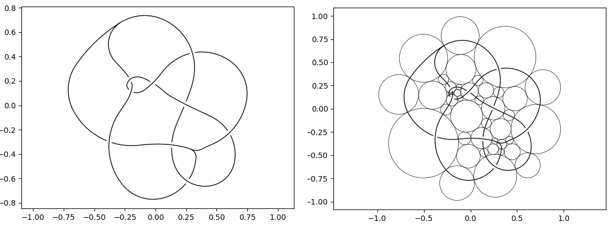

# PlanarDiagrams

Convert planar diagram codes of knots, links and spatial graphs to planar diagrams using circle packing and circular arcs.

## Example output

Input:
``` 
PD-code:
V[16,20,15];V[25,30,7];X[13,12,11,3];X[14,12,15,9];X[28,27,29,20];X[32,28,21,11];X[3,21,16,13];X[7,26,9,10];X[24,14,26,30];X[27,32,24,23];X[10,29,23,25]
```

Output:


## Installation

Use the package manager [pip](https://pip.pypa.io/en/stable/) to install dependencies.

```bash
pip install -r requirements.txt
```

## Planar diagram codes

A dictionary of planar diagram codes: **codes.py**

## Usage

```python
import planar_diagram

planar_diagram.render(pd_code: str, gap_size: float = 0.02, line_width:float = 1, show_circle_packing : bool = False)
```

### Example

example.py

```python
import planar_diagram
import codes

planar_diagram.render("V[16,20,15];V[25,30,7];X[13,12,11,3];X[14,12,15,9];X[28,27,29,20];X[32,28,21,11];X[3,21,16,13];X[7,26,9,10];X[24,14,26,30];X[27,32,24,23];X[10,29,23,25]")
```

## License

[MIT](https://choosealicense.com/licenses/mit/)
